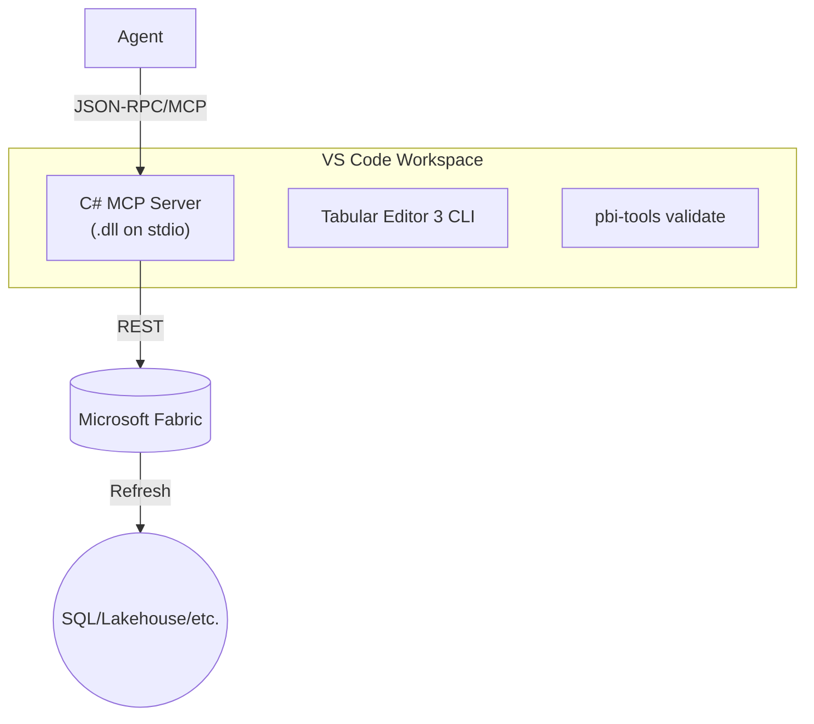

## Recipe: **C# MCP Server** — End‑to‑End Toolkit for Power BI Semantic Model Development via Fabric REST

> **Mission:** Give VS Code AI agents (Copilot, GPT‑based assistants, or custom bots) *full‑fidelity* control over Power BI **Semantic Models**—from green‑field creation to incremental updates, testing, refresh, and promotion—by exposing a rich **Model Context Protocol (MCP)** server built with the **official C# SDK** and the **Microsoft Fabric REST** surface.

---

### 1  Architecture at a Glance



1. **Agent** triggers a tool (e.g., `createSemanticModel`).
2. **Server** validates the model (`pbi‑tools`), packs TMDL, calls Fabric API.
3. **Long‑running operation** completes; server streams progress events.
4. **Optionally** triggers an **Enhanced Refresh** so the model is query‑ready.

---

## 2  Core Command Set (MCP Tools)

| Command                | Args                                 | What it does                                                            | Helpful libs                              |
| ---------------------- | ------------------------------------ | ----------------------------------------------------------------------- | ----------------------------------------- |
| `createSemanticModel`  | `name`, `description`, `tmdlFiles{}` | ZIPs & POSTs bundle to **Create Semantic Model** LRO.                   | `Azure.Identity`, `System.IO.Compression` |
| `updateSemanticModel`  | `modelId`, `tmdlFiles{}`             | PATCH `/updateDefinition` with new bundle.                              |                                           |
| `refreshSemanticModel` | `modelId`, `type` (default Full)     | POST to **Enhanced Refresh** dataset API.                               |                                           |
| `listSemanticModels`   | *(none)*                             | GET workspace items filter `type eq 'semanticModel'`.                   |                                           |
| `validateTmdl`         | `tmdlFiles{}`, `ruleset`             | Runs `pbi‑tools validate` → returns diagnostics.                        |                                           |
| `generateTmdl`         | `pbixPath`                           | Uses **Tabular Editor 3 CLI** to export PBIX → TMDL (migration helper). |                                           |
| `applyRls`             | `modelId`, `rolesJson`               | PATCH TMSL RLS script via XMLA.                                         |                                           |
| `setIncrementalPolicy` | `modelId`, `table`, `policyJson`     | Adds incremental refresh policy using XMLA.                             |                                           |
| `deployToStage`        | `pipelineId`, `stage`                | Calls **Fabric Deployment Pipeline** API to promote.                    |                                           |
| `diagnoseOperation`    | `operationId`                        | Polls `/operations/{id}` & streams detailed logs.                       |                                           |

> ℹ️ The MCP SDK lets you expose each command via `[McpTool]` and typed request/response records.

---

## 3  Expanded Project Structure

```
src/
  SemanticModelMcpServer/
    ⌞ Program.cs            # Host + builder
    ⌞ Tools/
        ├─ CreateSemanticModelTool.cs
        ├─ UpdateSemanticModelTool.cs
        ├─ RefreshTool.cs
        ├─ ValidateTmdlTool.cs
        ├─ DeploymentTool.cs
    ⌞ Services/
        ├─ FabricClient.cs   # wraps HttpClient, token cache
        ├─ ZipHelper.cs
        ├─ PbiToolsRunner.cs
        ├─ TabularEditorRunner.cs
    ⌞ Models/               # C# DTOs for requests/responses
Dockerfile                 # optional container deploy
.github/
  workflows/
    ci.yml                 # test + publish NuGet
    cd.yml                 # build image + push to GHCR
```

---

## 4  Implementation Building Blocks

### 4.1  Hosting & Dependency Injection

```csharp
Host.CreateDefaultBuilder(args)
    .ConfigureMcpServer(server =>
    {
        server.RegisterTools(Assembly.GetExecutingAssembly());
    })
    .ConfigureServices(svc =>
    {
        svc.AddHttpClient<FabricClient>();
        svc.AddSingleton<PbiToolsRunner>();
    })
    .RunConsoleAsync();
```

### 4.2  ZipHelper (in‑memory ZIP)

```csharp
public static byte[] PackTmdl(Dictionary<string,string> files)
{
    using var ms = new MemoryStream();
    using var archive = new ZipArchive(ms, ZipArchiveMode.Create, true);
    foreach (var (path,text) in files)
    {
        var entry = archive.CreateEntry(path, CompressionLevel.Optimal);
        await using var sw = new StreamWriter(entry.Open());
        await sw.WriteAsync(text);
    }
    archive.Dispose();
    return ms.ToArray();
}
```

### 4.3  pbi‑tools Validation Wrapper

```csharp
public async Task<PbiValidateResult> ValidateAsync(Dictionary<string,string> tmdlFiles)
{
    var temp = Path.Combine(Path.GetTempPath(), Path.GetRandomFileName());
    Directory.CreateDirectory(temp);
    // write files, run "pbi-tools validate"
    var psi = new ProcessStartInfo("pbi-tools", $"validate \"{temp}\"")
    { RedirectStandardOutput = true };
    var proc = Process.Start(psi)!;
    var output = await proc.StandardOutput.ReadToEndAsync();
    await proc.WaitForExitAsync();
    return ParseValidateOutput(output);
}
```

### 4.4  Enhanced Refresh Trigger

```csharp
public async Task TriggerRefresh(string datasetId)
{
    var body = new { type = "Full" }; // or "Incremental"
    await _http.PostAsJsonAsync($"/v1.0/myorg/datasets/{datasetId}/refreshes", body);
}
```

---

## 5  Testing Strategy

| Layer           | Tooling                                     | Notes                                                |
| --------------- | ------------------------------------------- | ---------------------------------------------------- |
| **Unit tests**  | `xUnit` + `Moq`                             | Mock `FabricClient`, confirm payloads & auth scopes. |
| **Integration** | `dotnet test --filter Category=Integration` | Requires env vars & Fabric test workspace.           |
| **Smoke**       | GitHub Action `on: pull_request`            | Runs `validateTmdl` against changed files.           |

---

## 6  Distribution & Deployment

* **NuGet package** — pack `SemanticModelMcpServer` so other teams can embed the server.
* **Docker image** — `FROM mcr.microsoft.com/dotnet/aspnet:8.0` → copy build output; container runs on stdio for VS Code **Dev Containers**.
* **Winget package** — optional for corporate desktops.

---

## 7  Security & Governance

* Use **Managed Identity** for AAD token when running in Azure VM/Container Apps.
* Store secrets in **Azure Key Vault**, injected via `DefaultAzureCredential`.
* Enforce **RLS, sensitivity labels, and audit logs** via supplementary calls to Fabric & Graph.
* Optional policy: block PBIX uploads by disabling classic workspace features.

---

## 8  Troubleshooting Matrix

| Symptom                       | Likely cause                                      | Fix                                                             |
| ----------------------------- | ------------------------------------------------- | --------------------------------------------------------------- |
| 401 Unauthorized              | Wrong scope (`.default`) or client secret expired | Verify AAD app & scopes; rotate secret.                         |
| LRO stuck in `Running`        | Zip missing `definition.pbism`                    | Confirm bundle contains *all* required parts.                   |
| Validation fails diff patch   | Incompatible schema changes (e.g., column delete) | Use `Tabular Editor Schema Compare` to create migration script. |
| VS Code doesn’t detect server | Bad `entry` path or extension not installed       | Check path & rebuild in Release mode.                           |

---

## 9  Sample Agent Prompts

> "Create a semantic model called **Finance** from the TMDL in the `./Models/Finance` folder and deploy to the *Dev* workspace. Then schedule an incremental refresh policy on the `FactFinance` table (RangeStart/End parameters)."

> "Add an RLS role `SalesManager` filtering `Region = \"West\"` to `Sales` semantic model and publish changes to Test."

---

## 10  Reference Links

* MCP C# SDK — [https://github.com/modelcontextprotocol/csharp-sdk](https://github.com/modelcontextprotocol/csharp-sdk)
* Fabric Create SM API — [https://learn.microsoft.com/rest/api/fabric/semanticmodel/items/create-semantic-model](https://learn.microsoft.com/rest/api/fabric/semanticmodel/items/create-semantic-model)
* Fabric Update Definition API — [https://learn.microsoft.com/rest/api/fabric/semanticmodel/items/update-semantic-model-definition](https://learn.microsoft.com/rest/api/fabric/semanticmodel/items/update-semantic-model-definition)
* Enhanced Refresh — [https://learn.microsoft.com/power-bi/connect-data/asynchronous-refresh](https://learn.microsoft.com/power-bi/connect-data/asynchronous-refresh)
* pbi‑tools CLI — [https://pbi.tools/](https://pbi.tools/)
* Tabular Editor CLI — [https://docs.tabulareditor.com/te2/Command-line-Options.html](https://docs.tabulareditor.com/te2/Command-line-Options.html)
* Deployment Pipelines Automation — [https://learn.microsoft.com/fabric/cicd/deployment-pipelines/pipeline-automation-fabric](https://learn.microsoft.com/fabric/cicd/deployment-pipelines/pipeline-automation-fabric)
* RLS Docs — [https://learn.microsoft.com/fabric/security/service-admin-row-level-security](https://learn.microsoft.com/fabric/security/service-admin-row-level-security)
* MCP servers in VS Code — [https://code.visualstudio.com/docs/copilot/chat/mcp-servers](https://code.visualstudio.com/docs/copilot/chat/mcp-servers)
* .NET Blog MCP sample — [https://devblogs.microsoft.com/dotnet/build-a-model-context-protocol-mcp-server-in-csharp/](https://devblogs.microsoft.com/dotnet/build-a-model-context-protocol-mcp-server-in-csharp/)

## 11  Full CI YAML (GitHub Actions)

> The workflow below compiles & tests the MCP server, builds a self‑contained publish, builds a Docker image with **BuildKit buildx**, and pushes to **GitHub Container Registry (GHCR)** when changes merge to `main` or a version tag ( `v*.*.*` ) is pushed. It uses PAT authentication stored in the repository secret \`\` and re‑uses the standard `.NET` and Docker setup actions. For multi‑registry scenarios, replicate the *Login & Push* step block.
> Based on patterns from GitHub Docs and Microsoft .NET DevOps guidance. ([docs.github.com](https://docs.github.com/en/actions/use-cases-and-examples/publishing-packages/publishing-docker-images), [docs.github.com](https://docs.github.com/en/actions/use-cases-and-examples/building-and-testing/building-and-testing-net), [dev.to](https://dev.to/willvelida/pushing-container-images-to-github-container-registry-with-github-actions-1m6b), [learn.microsoft.com](https://learn.microsoft.com/en-us/dotnet/devops/dotnet-publish-github-action), [learn.microsoft.com](https://learn.microsoft.com/en-us/dotnet/devops/github-actions-overview))

```yaml
name: CI

on:
  push:
    branches: [ main ]
    tags:     [ 'v*.*.*' ]
  pull_request:
    branches: [ main ]

permissions:
  contents: read
  packages: write   # needed to push to ghcr.io
  id-token: write   # for future OIDC login

jobs:
  build-test:
    runs-on: ubuntu-latest
    steps:
    - uses: actions/checkout@v4

    - uses: actions/setup-dotnet@v4
      with:
        dotnet-version: '8.0.x'

    - run: dotnet restore src/SemanticModelMcpServer/SemanticModelMcpServer.csproj
    - run: dotnet build -c Release --no-restore
    - run: dotnet test -c Release --no-build --verbosity normal
    - run: dotnet publish src/SemanticModelMcpServer/SemanticModelMcpServer.csproj -c Release -o ./publish -p:PublishTrimmed=true -p:PublishSingleFile=true --runtime linux-x64 --self-contained true

    - uses: actions/upload-artifact@v4
      with:
        name: publish
        path: ./publish

  docker:
    needs: build-test
    runs-on: ubuntu-latest
    environment: production
    steps:
    - uses: actions/download-artifact@v4
      with:
        name: publish
        path: ./publish

    - uses: docker/login-action@v3
      with:
        registry: ghcr.io
        username: ${{ github.actor }}
        password: ${{ secrets.GHCR_TOKEN }}

    - uses: docker/setup-qemu-action@v3
    - uses: docker/setup-buildx-action@v3

    - uses: docker/build-push-action@v5
      with:
        context: .
        file: ./Dockerfile
        push: true
        tags: ghcr.io/${{ github.repository }}/mcp-server:latest, ghcr.io/${{ github.repository }}/mcp-server:${{ github.sha }}
```

### Why it works

* \`\` caches the SDK and NuGet packages after first run. ([docs.github.com](https://docs.github.com/en/actions/use-cases-and-examples/building-and-testing/building-and-testing-net))
* **Buildx action** builds multi‑arch images with BuildKit. ([docs.github.com](https://docs.github.com/en/actions/use-cases-and-examples/publishing-packages/publishing-docker-images))
* Secret \`\` needs *`write:packages`* scope. ([docs.github.com](https://docs.github.com/en/packages/working-with-a-github-packages-registry/working-with-the-container-registry))

---

## 12  Dockerfile (Self‑contained MCP Server)

> Targets **.NET 8 runtime‑deps**; the build stage publishes a single‑file trimmed executable. ([gustavwengel.dk](https://www.gustavwengel.dk/dockerize-aspnet-in-pipelines), [learn.microsoft.com](https://learn.microsoft.com/en-us/azure/devops/pipelines/ecosystems/containers/publish-to-acr))

```dockerfile
# Build stage
FROM mcr.microsoft.com/dotnet/sdk:8.0 AS build
WORKDIR /src
COPY src/ ./
RUN dotnet publish SemanticModelMcpServer/SemanticModelMcpServer.csproj -c Release -o /app/publish -p:PublishSingleFile=true -p:PublishTrimmed=true --runtime linux-x64 --self-contained true

# Runtime stage
FROM mcr.microsoft.com/dotnet/runtime-deps:8.0
LABEL org.opencontainers.image.source="https://github.com/<org>/<repo>"
RUN adduser --system --uid 10001 appuser
WORKDIR /app
COPY --from=build /app/publish ./
USER 10001
ENTRYPOINT ["./SemanticModelMcpServer"]
```

---

##

```yaml
trigger:
  branches: [ main ]
  tags: [ 'v*' ]

pool:
  vmImage: ubuntu-latest

variables:
  imageName: mcp-server

steps:
- checkout: self

- task: UseDotNet@2
  inputs:
    packageType: sdk
    version: 8.x

- script: |
    dotnet restore src/SemanticModelMcpServer/SemanticModelMcpServer.csproj
    dotnet build -c Release --no-restore
    dotnet test -c Release --no-build
    dotnet publish src/SemanticModelMcpServer/SemanticModelMcpServer.csproj -c Release -o $(Build.ArtifactStagingDirectory)/publish -p:PublishSingleFile=true -p:PublishTrimmed=true --runtime linux-x64 --self-contained true
  displayName: Build & Test

- task: Docker@2
  displayName: Build & Push
  inputs:
    containerRegistry: $(dockerServiceConnection)
    repository: $(imageName)
    command: buildAndPush
    Dockerfile: **/Dockerfile
    tags: |
      latest
      $(Build.BuildId)
```

---

## 14  Next Steps

* **Release jobs** (deploy) — run the container in AKS / Azure Container Apps or as a VS Code extension runtime asset.
* **Supply‑chain** — add SBOM generation (`github/sbom-action`) and image signing (`sigstore/cosign`).
* **SAST & secret scan** — integrate `dotnet-format`, `trivy`, or `gh secret‑scan`.

---

## 10  Reference Links

(The reference table in section 10 remains unchanged.)
